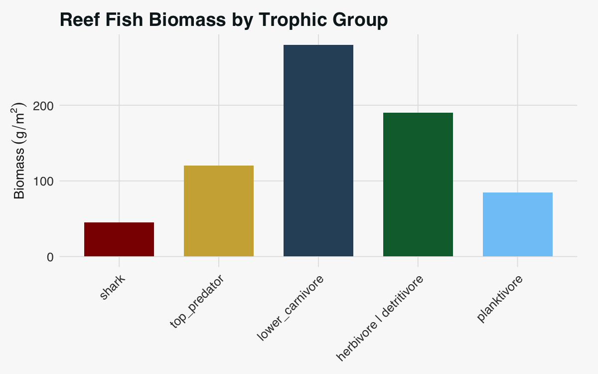
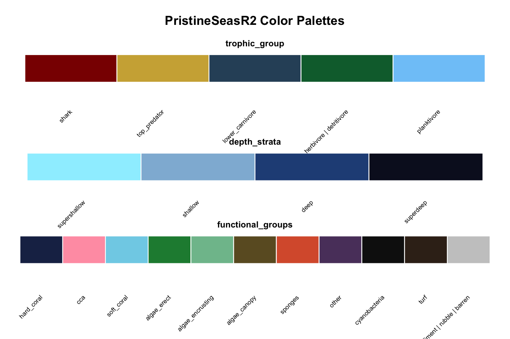

<!-- README.md is generated from README.Rmd. Please edit that file -->

# PristineSeasR2

<!-- badges: start -->

[](https://github.com/pristine-seas/PristineSeasR2/actions/workflows/R-CMD-check.yaml)
[](https://lifecycle.r-lib.org/articles/stages.html#experimental)
<!-- badges: end -->

**PristineSeasR2** is the data science toolkit for [National Geographic
Pristine
Seas](https://www.nationalgeographic.org/society/our-programs/pristine-seas/).
It provides standardized vocabularies, validation tools, color palettes,
and utilities that ensure consistency across our marine conservation
research.

## Installation

``` r
# install.packages("pak")
pak::pak("pristine-seas/PristineSeasR2")
```

## Standardized Vocabularies

Controlled vocabularies ensure consistent data entry across expeditions
and analysts:

``` r
library(PristineSeasR2)

# Five standardized vocabularies
names(allowed_vocab)
#> [1] "trophic_group"     "depth_strata"      "exposure"         
#> [4] "uvs_habitats"      "functional_groups"

# Trophic classifications for reef fish
allowed_vocab$trophic_group
#> [1] "shark"                   "top_predator"           
#> [3] "lower_carnivore"         "herbivore | detritivore"
#> [5] "planktivore"
```

### Data Validation

Catch non-standard entries early — `validate_vocab()` stops your
pipeline if invalid values are found:

``` r
# Valid data passes
validate_vocab(c("shark", "top_predator", "planktivore"), "trophic_group")
```

``` r
# Invalid data stops with informative error
validate_vocab(c("shark", "apex_predator"), "trophic_group")
#> Error: Invalid values found in 'trophic_group'
#> Found 1 invalid value(s): apex_predator
#> Allowed values: shark, top_predator, lower_carnivore, herbivore | detritivore, planktivore
```

## Color Palettes

Publication-ready colors designed for marine science visualization:

``` r
library(ggplot2)

# Example: Trophic group colors
trophic_colors <- ps_colors("trophic_group")

# Sample data
fish_data <- data.frame(
  trophic_group = factor(names(trophic_colors), levels = names(trophic_colors)),
  biomass = c(45, 120, 280, 190, 85)
)

ggplot(fish_data, aes(x = trophic_group, y = biomass, fill = trophic_group)) +
  geom_col(width = 0.7) +
  scale_fill_ps("trophic_group") +
  labs(
    title = "Reef Fish Biomass by Trophic Group",
    x = NULL,
    y = expression(Biomass~(g/m^2))
  ) +
  theme_ps() +
  theme(legend.position = "none")
```



### Available Palettes



## Depth Stratification

Convert continuous depths to standardized survey categories:

``` r
depths_m <- c(2, 8, 12, 22, 45)

# Classify into strata
stratify(depths_m)
#> [1] "supershallow" "shallow"      "shallow"      "deep"         "superdeep"

# Get station suffixes for IDs
station_suffix(stratify(depths_m))
#> [1] "05m" "10m" "10m" "20m" "30m"
```

## Key Functions

| Function | Purpose |
|----|----|
| `allowed_vocab` | Standardized vocabularies for survey data |
| `validate_vocab()` | Validate data against vocabularies |
| `ps_colors()` | Get color palettes |
| `scale_fill_ps()` / `scale_color_ps()` | ggplot2 color scales |
| `theme_ps()` / `theme_ps_map()` | ggplot2 themes |
| `stratify()` | Depth stratification |
| `get_drive_paths()` | Access shared Google Drive folders |
| `create_expedition()` | Create expedition folder structure |

## Learn More

- [Function
  Reference](https://pristine-seas.github.io/PristineSeasR2/reference/)
- [Pristine Seas
  Website](https://www.nationalgeographic.org/society/our-programs/pristine-seas/)

------------------------------------------------------------------------

<p align="center">

<em>Developed by the Pristine Seas Science Team</em>
</p>
