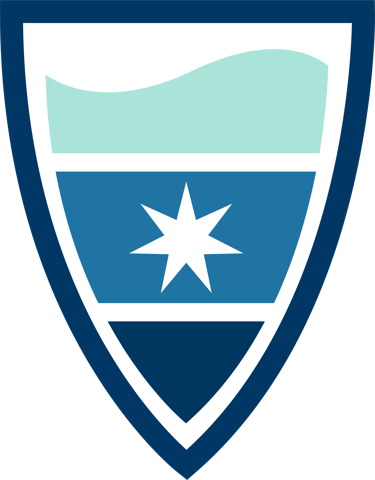
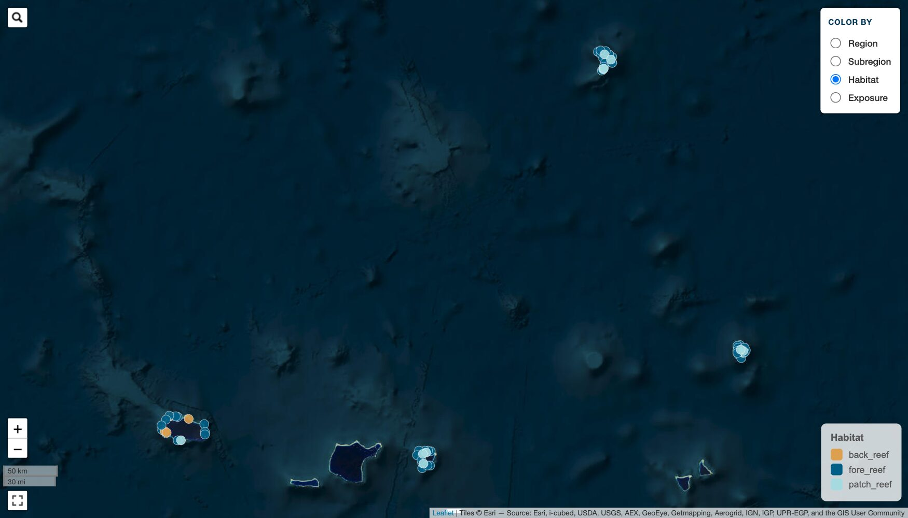
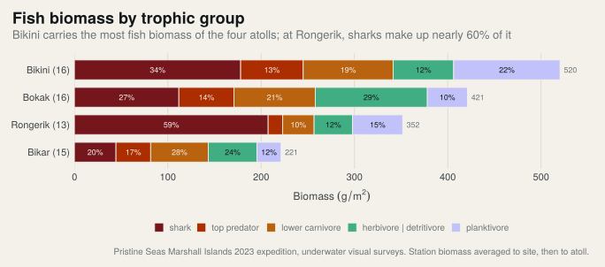
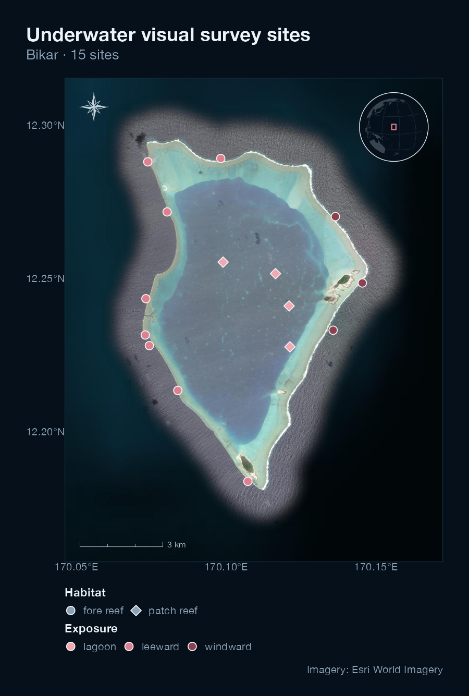
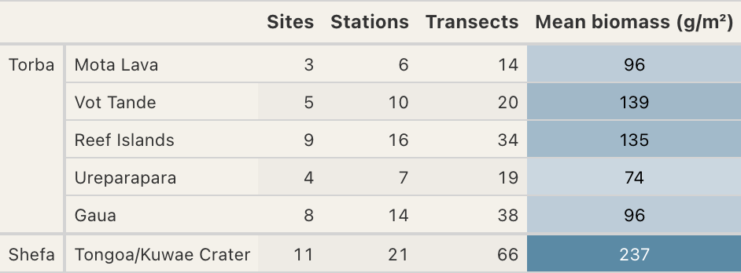

<!-- README.md is generated from README.Rmd. Please edit that file -->

# PristineSeasR2 

<p class="subtitle">

The science toolkit of National Geographic Pristine Seas
</p>

<!-- badges: start -->

[](https://lifecycle.r-lib.org/articles/stages.html#experimental)
[](https://pristine-seas.github.io/PristineSeasR2/)
<!-- badges: end -->

PristineSeasR2 is built for the [Pristine
Seas](https://www.nationalgeographic.org/society/our-programs/pristine-seas/)
research team and the collaborators and partners who work with us. Its
tools carry an expedition’s data the whole way, from raw field sheets to
the shared database to the report. It standardizes how we organize,
check, and present expedition data, helping us reduce errors and keep
our science rigorous, transparent, and reproducible.

Every tool is documented, with articles on the [colour
system](https://pristine-seas.github.io/PristineSeasR2/articles/colour-system.html)
and on [thermal
stress](https://pristine-seas.github.io/PristineSeasR2/articles/crw-dhw.html),
on the [package site](https://pristine-seas.github.io/PristineSeasR2/).

## Installation

``` r
# install.packages("pak")
pak::pak("pristine-seas/PristineSeasR2")
```

That installs everything the vocabularies, themes, tables and
interactive maps need. A few tools reach further and ask for more on
first use:

- `map_uvs_sites()` draws its basemaps with **maptiles**, **tidyterra**
  and **ggspatial**, and offers to install them the first time it is
  called. The Mapbox basemap also needs a token in the `MAPBOX_TOKEN`
  environment variable.
- `get_taxonomic_ranks()` queries the World Register of Marine Species
  through **worrms**.
- `explore_s1_detections()` and `explore_s2_detections()` render
  satellite crops through Google Earth Engine, so they need **rgee** and
  an Earth Engine account.
- `validate_and_export_csv()` reads the live table schema from BigQuery,
  so it needs access to the `pristine-seas` project.

## At a glance

| Stage | Tools |
|----|----|
| Set up and prepare | `create_expedition()`, `create_project()`, `ps_science_paths()`, `get_crw_dhw_sf()`, `get_crw_dhw_bbox()` |
| Process and QA/QC | `clean_field_names()`, `get_taxonomic_ranks()`, `stratify()`, `station_suffix()`, `allowed_vocab`, `validate_vocab()`, `validate_and_export_csv()` |
| Explore | `explore_uvs_sites()`, `explore_fish_biomass()`, `explore_benthic_cover()`, `explore_invert_density()`, `explore_recruit_density()`, `explore_s1_detections()`, `explore_s2_detections()` |
| Publish | `theme_ps()`, `theme_ps_map()`, `map_uvs_sites()`, `gt_theme_ps()`, `gt_theme_ps_light()`, `ps_colors()`, `ps_shapes()`, `scale_fill_ps()`, `scale_color_ps()`, `scale_shape_ps()` |
| Data | `rmi_2023_uvs_sites` and `rmi_2023_uvs_blt_stations`, the sites and fish stations of one real expedition, to try the tools on |

## From field sheet to report

The tools follow an expedition’s data through its life: set up and
prepare the expedition, work at sea, process and check the data, explore
it, and publish figures, maps and tables that read as one family.
Everything below runs on the bundled `rmi_2023_uvs_sites` and
`rmi_2023_uvs_blt_stations`, the sixty underwater visual survey sites of
the 2023 expedition to the northern atolls of the Marshall Islands and
their fish belt-transect stations, so it can be run anywhere, with no
Drive or database connection.

``` r
library(PristineSeasR2)
library(dplyr)
library(ggplot2)
```

### 1. Set up and prepare

Before the ship leaves, `create_expedition()` gives every expedition the
same folder tree on the shared Drive, so raw field sheets, processed
data and analysis-ready outputs are always where the next person expects
them. `create_project()` does the same for work that is not tied to one
expedition.

``` r
create_expedition("RMI-2023")
#> Created 11 expedition folders
#> Created README.md
```

    RMI-2023/
    ├── data/
    │   ├── primary/
    │   │   ├── raw/          unmodified field data
    │   │   ├── processed/    QA/QC applied
    │   │   └── output/       analysis-ready
    │   └── secondary/        external sources
    ├── documents/  figures/  gis/  media/
    ├── presentations/  reports/  references/
    └── README.md

`ps_science_paths()` finds the shared Drive on any team member’s
machine, Mac or Windows, and returns the paths to `SCIENCE` and its
`datasets`, `expeditions` and `projects` folders, so scripts carry no
hard-coded paths.

``` r
paths <- ps_science_paths()

paths$expeditions
#> [1] ".../My Drive/Pristine Seas/SCIENCE/expeditions"
```

Planning also means knowing what the reefs have been through.
`get_crw_dhw_sf()` pulls NOAA Coral Reef Watch degree heating weeks for
any survey area, so the team goes in with a picture of recent thermal
stress and what to expect on the reef. The [thermal stress
article](https://pristine-seas.github.io/PristineSeasR2/articles/crw-dhw.html)
walks through it.

### 2. At sea

Tools for the field, for logging dives, stations and observations as
they happen, are the next thing this package will hold.

### 3. Process and QA/QC

Back from the field, the data is cleaned, checked against the
vocabularies and matched to the World Register of Marine Species before
anything is analysed.

Field sheets spell taxa many ways. `clean_field_names()` brings them to
one form, and can log every change it made.

``` r
clean_field_names(c("ACROPORA SP.",
                    "Porites cf. lobata",
                    "Pocillopora (damicornis)",
                    "Stylophora  pistillata"),
                  auto_approve = TRUE)
#> [1] "Acropora"              "Porites lobata"        "Pocillopora"          
#> [4] "Stylophora pistillata"
```

`get_taxonomic_ranks()` fills in the classification for each accepted
AphiaID, one row per taxon, straight from WoRMS.

``` r
get_taxonomic_ranks(c(125286, 254941),
                    ranks = c("phylum", "class", "order", "family"))
#> # A tibble: 2 × 5
#>   accepted_aphia_id phylum        class        order           family       
#>               <dbl> <chr>         <chr>        <chr>           <chr>        
#> 1            125286 Cnidaria      Octocorallia Malacalcyonacea Clavulariidae
#> 2            254941 Echinodermata Asteroidea   Valvatida       Oreasteridae
```

`stratify()` turns depths into the standard survey strata, and
`station_suffix()` turns the strata into the suffixes that name a
station, the same way on every expedition.

``` r
depths_m <- c(2, 8, 12, 22, 45)

stratify(depths_m)
#> [1] "supershallow" "shallow"      "shallow"      "deep"         "superdeep"

station_suffix(stratify(depths_m))
#> [1] "05m" "10m" "10m" "20m" "30m"
```

The controlled vocabularies in `allowed_vocab`, and `validate_vocab()`,
which stops the pipeline on the first non-standard value, catch errors
before they spread into the analysis.

``` r
names(allowed_vocab)
#> [1] "trophic_group"     "depth_strata"      "exposure"         
#> [4] "uvs_habitats"      "functional_groups"

allowed_vocab$exposure
#> [1] "windward"  "leeward"   "lagoon"    "channel"   "sheltered" "exposed"  
#> [7] "unknown"

validate_vocab(rmi_2023_uvs_sites$exposure, "exposure")
```

``` r
validate_vocab(c("windward", "seaward"), "exposure")
#> Error:
#> ! Invalid values found in 'exposure'
#> Found 1 invalid value(s): seaward
#> Allowed values: windward, leeward, lagoon, channel, sheltered, exposed, unknown
```

When a pipeline’s output is ready for the database,
`validate_and_export_csv()` checks its columns against the live BigQuery
table before writing the CSV, so a renamed or missing column is caught
at export rather than after upload.

### 4. Explore

Once the data is processed, `explore_uvs_sites()` puts every site on an
interactive map, coloured by region, subregion, habitat or exposure,
with the field notes in each popup, so the team can review a survey
together before anything is written up. One call, one design, every
expedition. Regions and subregions differ every trip, so their colours
are set once in the expedition’s setup script; habitat and exposure use
the house palettes.

``` r
# Each atoll was its own region on this expedition, so the two palettes agree
atolls <- c(Bikar = "#005F87", Bokak = "#DCA04F", Bikini = "#8E81CE", Rongerik = "#40AE82")
```

``` r
explore_uvs_sites(rmi_2023_uvs_sites,
                  region_palette    = atolls,
                  subregion_palette = atolls,
                  title             = "Marshall Islands 2023 survey sites",
                  export_path       = "figures/uvs_sites.html")
```



The same family of maps covers fish biomass, benthic cover,
invertebrates and recruits with `explore_fish_biomass()`,
`explore_benthic_cover()`, `explore_invert_density()` and
`explore_recruit_density()`. `explore_s1_detections()` and
`explore_s2_detections()` map Global Fishing Watch vessel detections
from Sentinel-1 radar and Sentinel-2 optical imagery, each popup opening
the satellite crop the detection was made from.

### 5. Publish

Every figure, map and table draws on the same palettes and themes, so a
report from any expedition reads as Pristine Seas. `theme_ps()` sets
charts on warm paper and `theme_ps_map()` sets maps on deep water, and
both share the same type, the same palettes through `scale_fill_ps()`,
`scale_color_ps()` and `scale_shape_ps()`, and the same legend geometry,
so they can sit side by side on a page and read as a pair. The palettes
are keyed to `allowed_vocab`, so a validated column lands on its colours
without a lookup.

<details>

<summary>

Show code
</summary>

``` r
# Each station carries its total biomass and the share of each trophic group.
# Station values are averaged to the site, then sites to the atoll.
groups <- c(pct_shark = "shark", pct_top_predator = "top_predator", pct_lower_carni = "lower_carnivore",
            pct_herbi_detri = "herbivore | detritivore", pct_plankti = "planktivore")

by_atoll <- rmi_2023_uvs_blt_stations |>
  tidyr::pivot_longer(all_of(names(groups)), names_to = "trophic_group", values_to = "pct") |>
  mutate(trophic_group = groups[trophic_group], biomass = avg_biomass_gm2 * pct / 100) |>
  summarise(biomass = mean(biomass), .by = c(region, ps_site_id, trophic_group)) |>
  summarise(biomass = mean(biomass), .by = c(region, trophic_group)) |>
  mutate(share = biomass / sum(biomass), .by = region) |>
  mutate(region        = reorder(region, biomass, sum),
         trophic_group = factor(trophic_group, names(ps_colors("trophic_group")))) |>
  # label a segment only when it is wide enough to hold the number, in dark or
  # light text depending on how light the segment's own colour is
  mutate(label = ifelse(biomass >= 25, sprintf("%.0f%%", 100 * share), ""),
         text  = ifelse(farver::get_channel(ps_colors("trophic_group")[as.character(trophic_group)], "l", space = "lab") > 60,
                        ps_ink("chart")[["title"]], ps_ink("chart")[["canvas"]]))

n_sites <- rmi_2023_uvs_sites |> count(region) |> tibble::deframe()
totals  <- by_atoll |> summarise(total = sum(biomass), .by = region)

ggplot(by_atoll, aes(biomass, region, fill = trophic_group)) +
  geom_col(width = 0.72, position = position_stack(reverse = TRUE),
           colour = ps_ink("chart")[["canvas"]], linewidth = 0.4) +
  geom_text(aes(label = label, colour = text, group = trophic_group),
            position = position_stack(vjust = 0.5, reverse = TRUE),
            size = 3.1, family = ps_font_default()) +
  geom_text(data = totals, aes(total, region, label = round(total)), inherit.aes = FALSE,
            hjust = -0.3, size = 3.1, colour = ps_ink("chart")[["muted"]], family = ps_font_default()) +
  scale_fill_ps("trophic_group", labels = \(x) gsub("_", " ", x)) +
  scale_colour_identity() +
  scale_x_continuous(breaks = seq(0, 600, 100), expand = expansion(mult = c(0, 0.06))) +
  scale_y_discrete(labels = \(x) paste0(x, " (", n_sites[x], ")")) +
  labs(title    = "Fish biomass by trophic group",
       subtitle = "Bikini carries the most fish biomass of the four atolls; at Rongerik, sharks make up nearly 60% of it",
       caption  = "Pristine Seas Marshall Islands 2023 expedition, underwater visual surveys. Station biomass averaged to site, then to atoll.",
       x = expression(Biomass~(g/m^2)), y = NULL, fill = NULL) +
  theme_ps() +
  theme(legend.position = "bottom",
        panel.grid.major.y = element_blank())
```

</details>



A survey site map for the report is one call. `map_uvs_sites()` takes
the standard sites table, fits the frame to the sites chosen, and draws
them on satellite imagery with habitat as shape and exposure as fill, a
compass rose, a scale bar and a locator globe, all in the house style.
Here, the sites of Bikar Atoll.

``` r
map_uvs_sites(rmi_2023_uvs_sites, region = "Bikar")
```



Tables follow the same idea. `gt_theme_ps()` turns a summary into the
house table, with optional group columns, spanners, a set-off total
column and heat-filled cells. `gt_theme_ps_light()` is its plain,
compact sibling for the diagnostic tables a QA/QC check produces.

<details>

<summary>

Show code
</summary>

``` r
habitats <- c("fore_reef", "back_reef", "patch_reef")

effort <- rmi_2023_uvs_sites |>
  count(region, habitat) |>
  tidyr::pivot_wider(names_from = habitat, values_from = n, values_fill = 0) |>
  left_join(summarise(rmi_2023_uvs_sites, days = n_distinct(date), sites = n(), .by = region),
            by = "region") |>
  select(region, days, all_of(habitats), sites)

effort_table <- effort |>
  gt_theme_ps(rowname_col  = "region",
              col_labels   = c(days = "Survey days", sites = "Sites",
                               fore_reef = "Fore reef", back_reef = "Back reef", patch_reef = "Patch reef"),
              spanners     = list(`Sites by habitat` = habitats),
              total_col    = "sites",
              heatmap_cols = habitats,
              zero_dash    = TRUE) |>
  gt::tab_options(table.background.color = ps_ink("chart")[["canvas"]])
```

</details>



`ps_show_palette()` previews any of the palettes, and the [colour system
article](https://pristine-seas.github.io/PristineSeasR2/articles/colour-system.html)
shows how they were built and how they hold up under colour-blind and
greyscale reproduction.

## Getting help

Open an [issue](https://github.com/pristine-seas/PristineSeasR2/issues)
for bugs and requests. The package is developed by the Pristine Seas
science team and is under active development, so the API may still
change between minor versions. To cite it, run
`citation("PristineSeasR2")`.

<p align="center">


</p>
