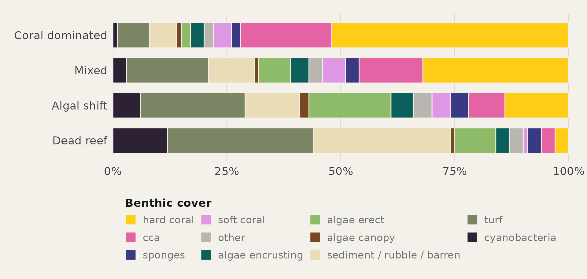
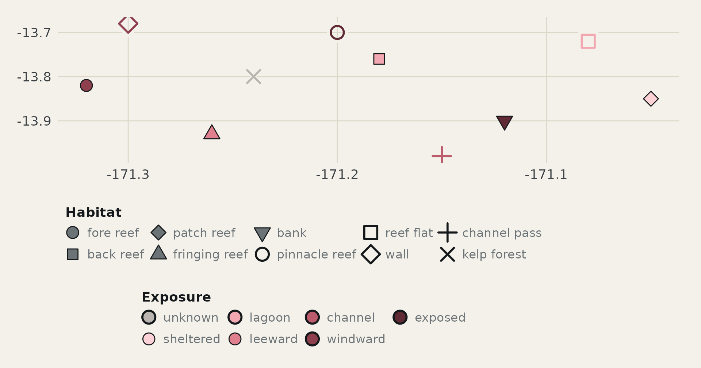
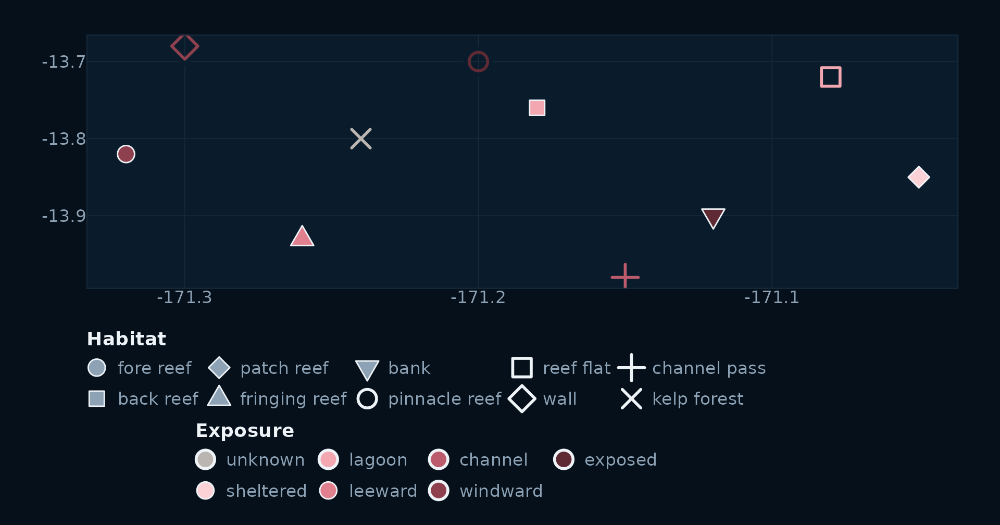

# Pristine Seas colour system

Coordinated palettes for scientific figures, maps and editorial
graphics.

Colours are chosen to be ecologically true and visually right, then
measured: every pair is checked with CIEDE2000 under normal vision, the
three dichromacies and greyscale, on both the light chart paper and the
dark map water. Separation is spent where it is needed. The classes that
carry most figures get the widest spacing, and the palettes are held
apart from one another so they can share a page, or a map.

Every palette lives in
[`ps_colors()`](https://pristine-seas.github.io/PristineSeasR2/reference/ps_colors.md),
and every ggplot2 scale in this package pulls from it:

``` r

ps_colors()
#> [1] "depth_strata"  "trophic_group" "benthic_cover" "exposure"     
#> [5] "habitat"

ps_colors("depth_strata")
#> supershallow      shallow         deep    superdeep 
#>    "#96D8DE"    "#52B2CD"    "#007EB1"    "#015871"
```

Names match the vocabulary in `allowed_vocab`, so a factor built from
validated data lands on the right colour without a lookup.
[`scale_fill_ps()`](https://pristine-seas.github.io/PristineSeasR2/reference/scale_fill_ps.md)
and
[`scale_color_ps()`](https://pristine-seas.github.io/PristineSeasR2/reference/scale_color_ps.md)
take a palette name;
[`scale_shape_ps()`](https://pristine-seas.github.io/PristineSeasR2/reference/scale_shape_ps.md)
does the same for the habitat shapes.

## Palettes

Use the controls to see every palette on this page as a colour-blind
reader or a greyscale print would, and on either canvas.

Vision

Normal

Deuteranopia

Protanopia

Tritanopia

Greyscale

Canvas

Chart paper

Map water

### 1. Depth strata

Four blues, dark with depth. The two middle strata carry most figures
and get the widest spacing.

### 2. Fish trophic group

Ordered from apex to base so a stacked bar reads top down. The reds are
held for sharks and top predators, the classes fishing removes first, so
the loss reads as a loss of warmth.

### 3. Benthic cover

Eleven classes, the most a palette here carries. Hard coral and turf are
the two a reader compares most, so they sit at opposite ends in hue and
lightness. The three algal groups share a green family; the calcifiers,
CCA and soft coral, share a pink one.

### 4. Exposure

A single sequential ramp, sheltered to exposed, plus a neutral grey for
sites whose exposure is not recorded. On a site map exposure fills the
marker.

### 5. Habitat

Five slots, named by default for the zones sampled on most trips. A trip
that samples other habitats reassigns the same five colours in order
with
[`ps_habitat_colors()`](https://pristine-seas.github.io/PristineSeasR2/reference/ps_habitat_colors.md),
so a figure always draws on the same well-separated set.

``` r

ps_habitat_colors(c("fore_reef", "pinnacle_reef", "wall"))
#>     fore_reef pinnacle_reef          wall 
#>     "#005F87"     "#DCA04F"     "#A5DBE0"
```

Habitat also has a shape palette, `ps_shapes("habitat")`, and it covers
every level of the vocabulary in three tiers by how often a habitat is
sampled. The filled and open tiers share the same five silhouettes so a
legend reads as one family. On a map, exposure fills the marker and
habitat sets its shape: filled shapes take the exposure as their fill
with the ink as outline, and open and line shapes take it as their
stroke over a halo in the canvas colour.

Filled (21–25) — sampled on most trips

fore
reefback
reefpatch
reeffringing
reefbank

Open (0–2, 5–6) — sampled occasionally

pinnacle
reefreef
flatwallreef
pavementrocky
reef

Line (3, 4, 8) — rarely sampled

channel
passkelp
forestseagrass

On maps — exposure fills the marker, habitat sets its shape

## Distinctiveness

Two colours are distinct when a reader can tell them apart without a
legend beside them. CIEDE2000, written ΔE₀₀, is the standard measure of
that perceived difference. A value under 10 is a near match; 20
separates most readers; above 30 no one confuses the pair. The matrix
follows the vision control above, and the report beneath it names the
closest pair, the closest pair among the classes that carry most
figures, and any colour that comes close to one in another palette.

Closer

More distinct

## In R

The scales take a palette name and match levels by name, so the data
decides which colours appear and the palette decides their order.

``` r

benthic <- bind_rows(lapply(states$benthic_cover, \(s) {
  tibble(state = s$name, class = names(ps_colors("benthic_cover")), share = s$share)
})) |>
  mutate(state = factor(state, levels = rev(unique(state))),
         class = factor(class, levels = rev(names(ps_colors("benthic_cover")))))

ggplot(benthic, aes(x = share, y = state, fill = class)) +
  geom_col(position = position_fill(reverse = TRUE), width = 0.72,
           colour = ink[["canvas"]], linewidth = 0.4) +
  scale_fill_ps("benthic_cover", labels = tidy) +
  scale_x_continuous(labels = \(x) paste0(x * 100, "%"), expand = c(0, 0)) +
  labs(x = NULL, y = NULL, fill = "Benthic cover") +
  theme_ps() +
  theme(panel.grid.major.y = element_blank(), legend.position = "bottom")
```



A site map uses three scales at once. Exposure is mapped to both `fill`
and `colour` so it reaches the filled and the open shapes; the colour
legend is dropped and the fill legend is drawn with filled circles so
there is one exposure key. A halo layer under the open shapes lifts them
off the canvas.

``` r

sites <- tibble(
  lon      = c(-171.32, -171.18, -171.05, -171.26, -171.12, -171.20,
               -171.30, -171.08, -171.15, -171.24),
  lat      = c( -13.82,  -13.76,  -13.85,  -13.93,  -13.90,  -13.70,
                -13.68,  -13.72,  -13.98,  -13.80),
  habitat  = c("fore_reef", "back_reef", "patch_reef", "fringing_reef", "bank",
               "pinnacle_reef", "wall", "reef_flat", "channel_pass", "kelp_forest"),
  exposure = c("windward", "lagoon", "sheltered", "leeward", "exposed",
               "exposed", "windward", "lagoon", "channel", "unknown")
) |>
  mutate(filled = ps_shapes("habitat")[habitat] >= 21)

site_markers <- function(sites, theme, ink) {
  ggplot(sites, aes(lon, lat, shape = habitat)) +
    geom_point(data = filter(sites, !filled), size = 4.6, stroke = 2.6,
               colour = ink[["panel"]], show.legend = FALSE) +
    geom_point(data = filter(sites, !filled), aes(colour = exposure, fill = exposure),
               size = 4.2, stroke = 1.2) +
    geom_point(data = filter(sites, filled), aes(fill = exposure),
               size = 4.2, stroke = 0.6, colour = ink[["title"]]) +
    scale_shape_ps("habitat", drop = TRUE, labels = tidy) +
    scale_fill_ps("exposure", drop = TRUE, name = "Exposure") +
    scale_color_ps("exposure", drop = TRUE, guide = "none") +
    guides(shape = guide_legend(override.aes = list(fill = ink[["muted"]],
                                                    colour = ink[["title"]])),
           fill  = guide_legend(override.aes = list(shape = 21,
                                                    colour = ink[["title"]]))) +
    labs(x = NULL, y = NULL, shape = "Habitat") +
    theme +
    theme(legend.box = "vertical", legend.justification = "left")
}
```

``` r

site_markers(sites, theme_ps(), ink)
```



``` r

site_markers(sites, theme_ps_map(), water)
```



## The palettes as R code

For a script that cannot take the package as a dependency.

    depth_strata = c("supershallow" = "#96D8DE",
                     "shallow"      = "#52B2CD",
                     "deep"         = "#007EB1",
                     "superdeep"    = "#015871")

    trophic_group = c("shark"                   = "#75161D",
                      "top_predator"            = "#AC2D00",
                      "lower_carnivore"         = "#B96310",
                      "herbivore | detritivore" = "#40AE82",
                      "planktivore"             = "#C1C2FA")

    benthic_cover = c("hard_coral"                 = "#FFCD16",
                      "cca"                        = "#E563A4",
                      "sponges"                    = "#393A81",
                      "soft_coral"                 = "#DE98E3",
                      "other"                      = "#BAB5B1",
                      "algae_encrusting"           = "#0D5F5B",
                      "algae_erect"                = "#8EBB67",
                      "algae_canopy"               = "#784620",
                      "sediment | rubble | barren" = "#E8DDB7",
                      "turf"                       = "#7B8563",
                      "cyanobacteria"              = "#2C2234")

    exposure = c("unknown"   = "#BAB5B1",
                 "sheltered" = "#FDD2D7",
                 "lagoon"    = "#F3A7B1",
                 "leeward"   = "#E07F8E",
                 "channel"   = "#BC5B6C",
                 "windward"  = "#8F404F",
                 "exposed"   = "#602A34")

    habitat = c("fore_reef"     = "#005F87",
                "back_reef"     = "#DCA04F",
                "patch_reef"    = "#A5DBE0",
                "fringing_reef" = "#6F3F1B",
                "bank"          = "#8E81CE")

    habitat_shape = c("fore_reef"     = 21,
                      "back_reef"     = 22,
                      "patch_reef"    = 23,
                      "fringing_reef" = 24,
                      "bank"          = 25,
                      "pinnacle_reef" =  1,
                      "reef_flat"     =  0,
                      "wall"          =  5,
                      "reef_pavement" =  2,
                      "rocky_reef"    =  6,
                      "channel_pass"  =  3,
                      "kelp_forest"   =  4,
                      "seagrass"      =  8)
